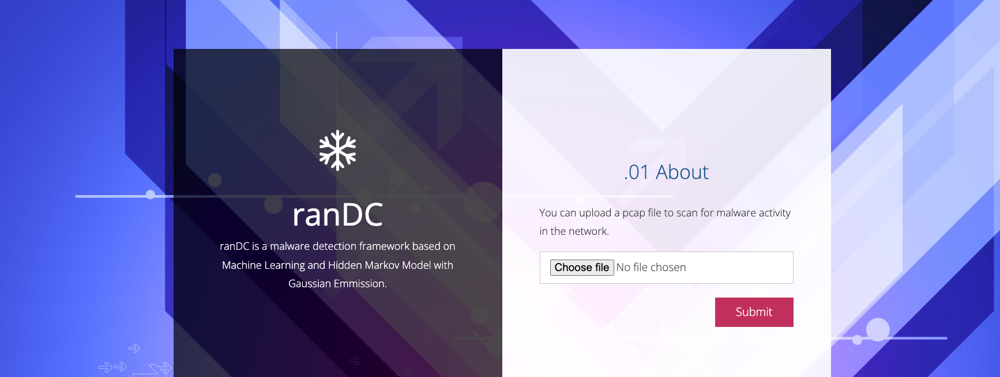
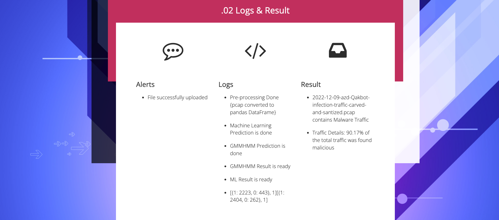

<h1 align="center">ranDC- Ransomware Detection using ML and GMMHMM</h1>

  <a href="#features">Features</a> |
  <a href="#installation">Installation</a> |
  <a href="#usage">Usage</a> 

# Features

- ranDC framework is trained on Machine Learning (ML) and Hidden Markov Model with Gaussian Emmission (GMMHMM).
- Network traffic dumps can be tested to check if it contains Ransomware/Malware traffic.
- Decision Tree Classifer predictions are validated using GMMHMM.
- Final state classifcation is done based on the <i>classfication_percentage</i>.
- For more details, read the paper <a href="#">Link</a>.

# Installation
- First clone the repository or download the zip file:  
<code> git clone https://github.com/amanonearth/ranDC.git </code> 
- Navigate to the directory 
<code> cd ranDC </code> 
- Create a virtual enviroment 
<code> python -m venv venv </code>  
- Activate virtual enviroment 
<code> source venv/bin/activate </code>  
- Install the requirements  
<code> pip install -r REQUIREMENTS.txt </code>  
- Run the run.py file:  
<code> python3 run.py </code>

# Usage
- Once the flask server is up and running 
- Upload a pcap file from the home page 
</a>
- Get the result. 
</a>
